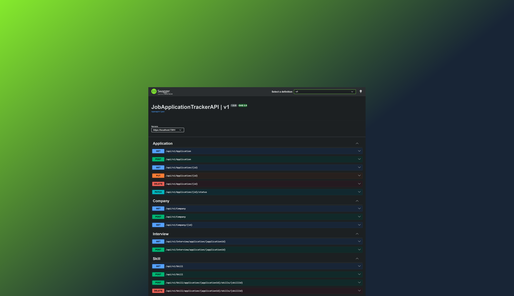

# Job Application Tracker API

## Overview

A RESTful ASP.NET Core Web API built using N-Tier Architecture and Entity Framework Core. This application provides job seekers with a centralized platform to manage job applications, track multi-stage interviews, associate required skill sets, and store target company details.



## Technical Stack & Architecture

- **Framework:** ASP.NET Core 9 Web API
- **ORM:** Entity Framework Core 9
- **Database:** SQL Server
- **Documentation:** Swagger / OpenAPI
- **Architecture:** N-Tier Layered Architecture
- **Controllers:** Request routing, parameter binding, and status code responses.
- **Business Logic Layer (BLL):** Domain logic, payload validation, and entity-to-DTO mappings.
- **Data Access Layer (DAL):** Repository abstractions and EF Core DbContext interactions.

## Domain Overview & Entities

This API has 5 core domain entities:

1. **User:** Tracks user profiles (`UserId`, `FirstName`, `LastName`, `Email`, `PasswordHash`, `CreatedAt`).

- **Relationship:** One-to-Many with `Application`.

2. **Company:** Stores target employer information (`CompanyId`, `Name`, `WebsiteUrl`, `Industry`, `Location`).

- **Relationship:** One-to-Many with `Application`.

3. **Application:** Core domain record (`ApplicationId`, `JobTitle`, `JobUrl`, `Status`, `AppliedDate`, `SalaryMin`, `SalaryMax`).

- **Relationships:** Belongs to `User` and `Company`; One-to-Many with `Interview`; Many-to-Many with `Skill`.

4. **Interview:** Manages hiring stages (`InterviewId`, `StageName`, `ScheduledAt`, `InterviewerName`, `Notes`, `IsCompleted`).

- **Relationship:** Belongs to `Application`.

5. **Skill:** Categorized technical and soft skills (`SkillId`, `Name`, `Category`).

- **Relationship:** Many-to-Many with `Application` (via `ApplicationSkill` associative entity).

## API Base Route & Endpoints

**Base Route:** `/api/v1`

### Application Endpoints

| Method     | Endpoint                   | Description                                                | Expected Status Codes |
| ---------- | -------------------------- | ---------------------------------------------------------- | --------------------- |
| **GET**    | `/application`             | List applications (with filtering, sorting and pagination) | 200                   |
| **GET**    | `/application/{id}`        | Get application details by ID                              | 200, 404              |
| **POST**   | `/application`             | Create a new application                                   | 201, 400              |
| **PUT**    | `/application/{id}`        | Update an existing application                             | 204, 400, 404         |
| **PATCH**  | `/application/{id}/status` | Update application status                                  | 204, 404              |
| **DELETE** | `/application/{id}`        | Delete an application                                      | 204, 404              |

### Interview Endpoints

| Method   | Endpoint                      | Description                              | Expected Status Codes |
| -------- | ----------------------------- | ---------------------------------------- | --------------------- |
| **POST** | `/interview/application/{id}` | Schedule an interview for an application | 201, 400              |
| **GET**  | `/interview/application/{id}` | Get all interviews for an application    | 200, 404              |

### Skill Endpoints

| Method     | Endpoint                             | Description                           | Expected Status Codes |
| ---------- | ------------------------------------ | ------------------------------------- | --------------------- |
| **GET**    | `/skills`                            | List all available skills             | 200                   |
| **POST**   | `/application/{id}/skills`           | Associate a skill with an application | 201, 400, 409         |
| **POST**   | `/application/{id}/skills/{skillId}` | Link existing skill to application    | 204, 404, 409         |
| **DELETE** | `/application/{id}/skills/{skillId}` | Remove skill from application         | 204, 404              |

### Company Endpoints

| Method   | Endpoint          | Description               | Expected Status Codes |
| -------- | ----------------- | ------------------------- | --------------------- |
| **GET**  | `/companies`      | List all companies        | 200                   |
| **GET**  | `/companies/{id}` | Get company details by ID | 200, 404              |
| **POST** | `/companies`      | Add a new company         | 201, 400              |

## Request & Response Examples

### 1. Create Application

- **Method / Endpoint:** `POST /api/v1/application`
- **Request Body:**

```json
{
  "companyId": 5,
  "jobTitle": "Full Stack Developer",
  "jobUrl": "https://www.linkedin.com/jobs/123",
  "status": "Applied",
  "appliedDate": "2026-09-27T10:00:00Z",
  "salaryMin": 75000,
  "salaryMax": 90000
}
```

- **Response (201 Created):**

```json
{
  "id": 2,
  "userId": 10,
  "companyId": 5,
  "jobTitle": "Full Stack Developer",
  "jobUrl": "https://www.linkedin.com/jobs/123",
  "status": "Applied",
  "appliedDate": "2026-09-27T10:00:00Z",
  "salaryMin": 75000,
  "salaryMax": 90000,
  "createdAt": "2026-09-27T12:00:00Z"
}
```

### 2. Get Application Details

- **Method / Endpoint:** `GET /api/v1/application/10`
- **Response (200 OK):**

```json
{
  "id": 10,
  "jobTitle": "Full Stack Developer",
  "status": "Interviewing",
  "appliedDate": "2026-09-27T10:00:00Z",
  "company": {
    "id": 2,
    "name": "Acme Technologies",
    "location": "Remote"
  },
  "interviews": [
    {
      "id": 3,
      "stageName": "Technical Screening",
      "scheduledAt": "2026-10-02T14:00:00Z",
      "interviewerName": "Jane Doe",
      "isCompleted": false
    }
  ],
  "requiredSkills": [
    {
      "id": 1,
      "name": "C#",
      "category": "Language"
    },
    {
      "id": 3,
      "name": "PostgreSQL",
      "category": "Database"
    }
  ]
}
```

### 3. Partial Status Update

- **Method / Endpoint:** `PATCH /api/v1/application/10/status`
- **Request Body:**

```json
{
  "status": "Offered"
}
```

- **Response (200 OK):**

```json
{
  "id": 10,
  "status": "Offered",
  "updatedAt": "2026-09-28T13:30:00Z"
}
```

## Setup and Execution

1. **Clone Repository:**

```bash
git clone <repository-url>
cd JobApplicationTrackerAPI
```

2. **Configure Database Connection:**
   Update `appsettings.json` with your connection string:

```json
"ConnectionStrings": {
  "DefaultConnection": "Server=(localdb)\\mssqllocaldb;Database=JobApplicationTrackerDb;Trusted_Connection=True;MultipleActiveResultSets=true"
}
```

3. **Apply Database Migrations:**
   Run the following command in the Package Manager Console or terminal to create and seed the database:

```bash
Update-Database
```

4. **Run Application:**
   Swagger UI will open automatically after starting the application.
